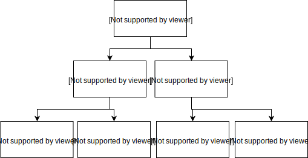
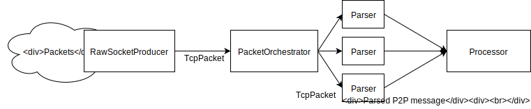

TezEdge Debugger
================
Network message debugger for applications running on the Tezos protocol.

The new Debugger is based on Raw Sockets and captures all packets that form the communication between the (local) node and rest of the (remote) network.
Replacing the TUN  (**tun**nel) devices with Raw Sockets allows for much easier networking setups with docker and docker-compose. No custom
scripts are needed.

How does it work
================
The Debugger relies on a Raw Socket to identify which packets are relevant to the running node. By sharing the same network as
the node and local identity, the Debugger is able to decode and deserialize the messages that are exchanged between nodes.

Requirements
============
* Docker
* (**RECOMMENDED**)  Steps described in Docker [Post-Installation](https://docs.docker.com/engine/install/linux-postinstall/). 

How to run
==========
Easiest way to launch the Debugger is by running it with the included docker-compose files. There are two separate files: one
for our Rust Tezedege Light Node (docker-compose.rust.yml) and the other for the original OCaml node (docker-compose.ocaml.yml).
A guide on how to change ports is included inside the docker-compose files.
```bash
docker-compose -f docker-compose.rust.yml build
docker-compose -f docker-compose.rust.yml up
```

(WIP) Debugger API
==================
The RPC endpoint of the Debugger is split into two parts: P2P messages on `/p2p/*` endpoints and RPC messages on `/rpc/*` endpoint.
### P2P
#### `/v2/p2p`
##### Description
Endpoint for checking all P2P communication on running node. 
Messages are always sorted from newest to oldest.
##### Query arguments
* `cursor_id : 64bit integer value` - Cursor offset, used for easier navigating in messages. Default is the last message.
* `limit : 64bit integer value` - Maximum number of messages returned by the RPC. Default is 100 messages.
* `remote_addr : String representing socket address in format "<IP>:<PORT>"` - Filter message belonging to communication with given remote node.
* `incoming : Boolean` - Filter messages by their direction
* `types : comma separated list of types` - Filter messages by given types
* `source_type: "local" or "remote"` - Filter messages by source of the message
##### Example
* `/v2/p2p` - Return last 100 P2P messages
* `/v2/p2p?cursor_id=100&types=connection_message,metadata` - Return all connection and metadata messages from first 100 messages.

### RPC
#### `/v2/rpc`
##### Description
Endpoint for checking all RPC Requests/Responses on running node.
Messages are always sorted from newest to oldest.
##### Query
* `cursor_id : 64bit integer value` - Cursor offset, used for easier navigating in messages. Default is the last message.
* `limit : 64bit integer value` - Maximum number of messages returned by the RPC. Default is 100 messages.
* `remote_addr : String representing socket address in format "<IP>:<PORT>"` - Filter message belonging to communication with given remote node.
##### Example
* `/v2/rpc?remote_addr=192.168.1.1:4852` - Show all requests made by the client with address 192.168.1.1:4852

### Logs
#### `/v2/log`
##### Description
Endpoint for checking all captured logs on running node
Messages are always sorted from newest to oldest.
##### Query arguments
* `cursor_id : 64bit integer value` - Cursor offset, used for easier navigating in messages. Default is the last message.
* `limit : 64bit integer value` - Maximum number of messages returned by the RPC. Default is 100 messages.
* `level : string` - Log level, should be on of `trace, debug, info, warn, error`
* `timestamp : string` - Unix timestamp representing time from which the logs are shown.
##### Example
* `/v2/log?level=error` - Return all errors in last one hundred logs,

Detailed Architecture
=====================
#### Packets, Chunks and Messages
Tezos nodes communicate by exchanging chunked P2P messages over the internet. Each part uses its own "blocks" of data.

##### Packet
Packets are used by the higher layers of TCP/IP models to transport application communication over the internet 
(there are more type of data blocks on lower levels of the model, like ethernet frames, but we do not work with those).
The Debugger captures TCP packets containing IPv4 or IPv6 headers and a TCP header. Those headers are required to determine
source and destination addresses for each packet.

#### Chunks
A binary chunk is a Tezos construct, which represents some sized binary block. Each chunk is a continuous memory, with the
first two bytes representing the size of the block. Chunks are send over internet in TCP Packets, but not necessarily one
chunk per packet. When receiving a new packet, the first two bytes represent how many bytes there should be in the whole chunk,
but not how many packets the chunk is split into.

#### Message
A message is parsed representation of some node command, but to be able to send them over internet, they must first be serialized into binary blocks of data, which are then converted into Binary Chunks and finally split into packets to be sent over internet. Again, it is not necessary, that single message is split into single binary chunk. It is required
to await enough chunks to deserialize message. 



#### Encryption

The primary feature of the Debugger is the ability to decrypt all messages while having access only to the single identity of the local
node.

##### Tezos "handshake"
To establish encrypted connection, Tezos nodes exchange `ConnectionMessages` which contain information about the nodes themselves,
including public keys, nonces, proof-of-stake and node running protocol version(s). The public key is static and is part of
a node's identity, as is proof-of-stake. Nonces are generated randomly for each connection message. After the `ConnectionMessage`
exchange, each node remembers the node it received and the nonce it sent, and creates the "precomputed" key (for speedups), which is
calculated from the local node's private key and remote node's public key. The nonce is a number incremented after each use.

* To encrypt a message, the node uses the nonce sent in its own `ConnectionMessage` and a precomputed key.
* To decrypt a message, the node uses the received nonce and a precomputed key.

For the Debugger to decrypt a message that is coming from a remote node to the local running node. It needs to know:
* The local node's private key - which is part of its local identity to which the Debugger has access.
* The remote node's public key - which is part of the received `ConnectionMessage` and was captured.
* The remote node's nonce - which is part of the received `ConnectionMessage` and was captured.

But to decrypt a message sent by the local node, it would be necessary to know the private key of the remote node, to which it does not have
access. Fortunately, Tezos is internally using the Curve5519 method, which allows to decrypt a message with the same 
keys which were used for encryption, thus the Debugger "just" needs the:
* Local node's private key - which is part of its local identity, to which the Debugger has access.
* Remote node's public key - which is part of the received `ConnectionMessage` and was captured.
* Local node's nonce - which is part of the sent `ConnectionMessage` and was captured.

#### System architecture

The basic concept of the whole system is based on the premise that captured data are moved through a pipeline of steps, which allows for easier
data processing. The basic pipeline for P2P messages consists of Producer - Orchestrator - Parsers and Processors:





All parts of system are defined in the [system module](./src/system)

##### Producers
The purpose of producers is to only capture and filter interesting network data.
`RawSocketProducer` captures all networking traffic on a specific networking interface, filtering all the non-TCP packets 
(as Tezos communication works only on TCP packets) and sends them further down the line into the Orchestrator

##### Orchestrator
Receives packets from the producer and orchestrates them into "logical streams", each stream of packets has its own parser.
The responsibility of the orchestrator is to manage and clean up parsers.
`PacketOrchestrator` Receives TCP packets, determines which address is the remote address, as that is the determining factor of 
which parser should process the packet. If no parser for the specific remote address exists, a new one is created instead.
If a packet denotes the end of communication with a remote address, the parser is stopped and cleaned. 

##### Parser
Receives packets which belong to some "logical stream", and processes them into the messages (parses packets into messages).
Parsed messages are forwarded into the processor.
`P2PParser` is responsible for aggregating packets into chunks and buffers chunks for final deserialization.
If `ConnectionMessages` are exchanged, parser also decrypts the data first.


##### Processors
All processors reside inside the single primary processor, which calls individual processors to process parsed data.
Currently, the only processor which is used is the database processor, which stores and indexes parsed messages.


#### Node Logs
To capture node logs, the Debugger utilizes the "syslog" protocol (which can be easily enabled in the Docker), which,
instead of printing the log into the console, wraps them into the UDP packet and sends them to the server. This should
be handled by the application or the administrator of the application. The Debugger runs a syslog server inside, to simply process the generated
logs. This system allows to decouple the Debugger from the node, which prevents the debugger from failing if the running node fails, 
preserving all of the captured logs, and potentially information about the failure of the node.

#### Storage
Storage is based on RocksDB, utilizing custom [indexes](./src/storage/secondary_index.rs), which
allows field filtering and cursor pagination.

#### RPC server
RPC server is based on the [warp crate](https://crates.io/crates/warp). All endpoints are based on cursor-pagination, 
meaning it is simple to paginate real-time data. All data are from local storage
